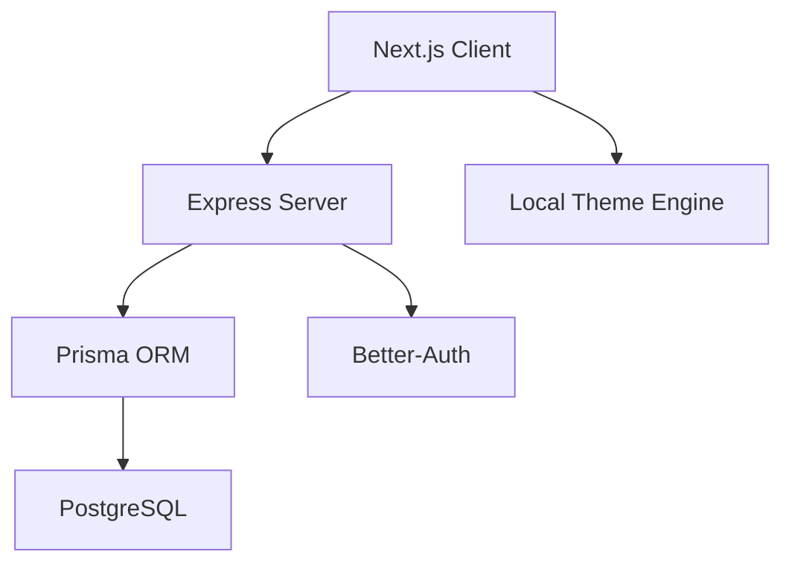

# 🎓 EduBridge — Connecting Minds, Empowering Futures


EduBridge is a state-of-the-art tutoring platform designed to facilitate seamless connections between students and expert tutors. Built with **Next.js 15**, **Tailwind CSS**, and **Framer Motion**, it offers a premium, responsive experience with full dark mode support and interactive dashboards.

## 🚀 Key Features

- **🔍 Advanced Search**: Find tutors by subject, price range, and rating with real-time filtering.
- **📅 Smart Booking**: Interactive availability management for tutors and easy booking for students.
- **📊 Professional Dashboards**: Custom overviews for Students, Tutors, and Admins with dynamic charts (Monthly activity, Subject distribution).
- **🌓 Global Dark Mode**: A premium, visually stunning theme-switching experience.
- **🛡️ Secure Auth**: Multi-provider authentication powered by `better-auth`.
- **⭐ Review System**: Verified reviews and ratings to maintain high quality standards.

## 💻 Tech Stack

- **Frontend**: Next.js 15 (App Router), TypeScript, Tailwind CSS, shadcn/ui.
- **Animation**: Framer Motion, GSAP.
- **State/Data**: React Query, Tanstack Table.
- **Theming**: next-themes.

## ⚒️ Installation & Setup

1. **Clone the repository**:
   ```bash
   git clone https://github.com/your-username/education-bridge.git
   cd education-bridge-client
   ```

2. **Install Dependencies**:
   ```bash
   npm install
   ```

3. **Environment Variables**:
   Create a `.env.local` file:
   ```env
   NEXT_PUBLIC_API_URL=http://localhost:5000
   ```

4. **Run Development Server**:
   ```bash
   npm run dev
   ```

## 🏗️ Architecture



## 📄 License
This project is licensed under the MIT License - see the [LICENSE](LICENSE) file for details.


